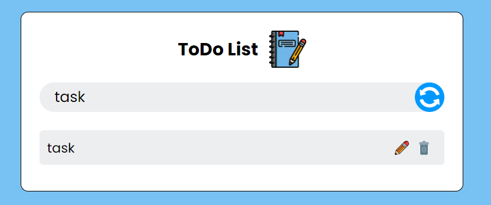

Variation of my "To Do list", with animation and popping messages.

This project has animations for the appearance of tasks, their deletion, and also pop-up text about changes in the list. There is also a memory effect, all added tasks will be saved on the user’s device.

Working on this project I improved my skills in creating elements and interacting with them through the DOM tree.
Also improved my skills in working with local storage.

Below are screenshots of To Do: 

1. Base view

2. Checked task:

3. Rename function

4. Pop-up text

5. Delete animation

6. One more image):

